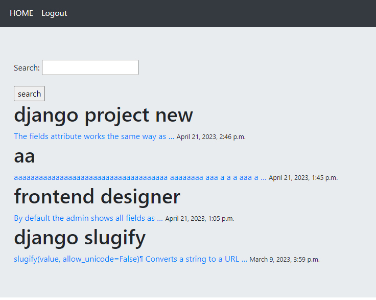
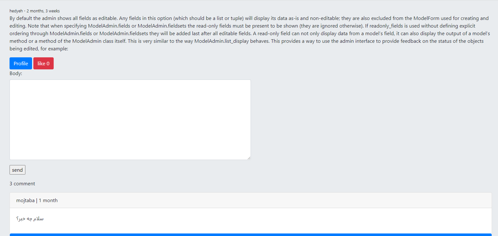

# social-django

instance of social web application with django

## Installation

Use the package manager [pip](https://pip.pypa.io/en/stable/) to install django packages.

```bash
pip install -r requirements.txt
```




## Contributing

Pull requests are welcome. For major changes, please open an issue first
to discuss what you would like to change.

Please make sure to update tests as appropriate.

## License

[MIT](https://choosealicense.com/licenses/mit/)
